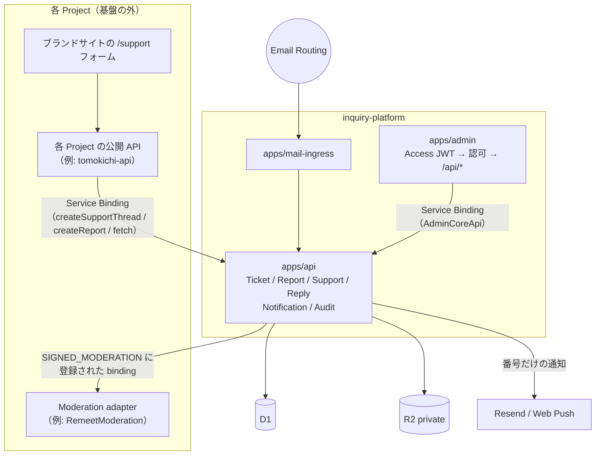

# Architecture

最終更新: 2026-09-24。

## 1. 境界

- Core（`apps/api`）は route も `workers.dev` も持たない。到達手段は Service Binding だけで、呼び出し側は `@inquiry-platform/core` の型しか知らない。
- 公開の受付口（Turnstile・client key・rate limit）は現在 Project 側（tomokichi-api）にある。基盤側の汎用受付 API（`POST /v1/tickets` 等）は Phase 3 で追加する（[cutover](../operations/cutover.md)）。
- 基盤が知るのは「誰が・どの対象を・何の理由で」まで。対象が何であるか、どう消すかは Project が知る（Moderation adapter）。

## 2. Project

- **Project の正は `apps` 表**（slug、名前、リンク、メール署名）。管理画面の「アプリ」は Project のこと。
- `services` 表は Ticket 分類用の写しで、`apps` への INSERT トリガで同期される（`0006_ticket_core.sql`）。`services.studio` は Tomokichi 環境の「特定アプリに属さない問い合わせ」用の通常データ。
- Tenant は導入しない。外部提供を始めるときに `Tenant → Project` へ拡張する。

## 3. Ticket モデル

現行モデルを正とする（ADR-022、tomokichi-studio `docs/DECISIONS.md`）。

| 項目 | 値 |
|---|---|
| type | `INQUIRY` / `REPORT` / `BUG` / `INCIDENT` / `BILLING` / `PRIVACY` / `OTHER` |
| status | `NEW` / `TRIAGE` / `ACKNOWLEDGED` / `IN_PROGRESS` / `WAITING_CUSTOMER` / `WAITING_INTERNAL` / `RESOLVED` / `CLOSED` |
| resolution | `RESOLVED` / `NO_ACTION_REQUIRED` / `SPAM` / `DUPLICATE` / … / `CONTENT_REMOVED` |
| 表示 ID | `ticket_numbers.seq`（DB の主キーとは別） |
| 旧 ID | `ticket_sources(source_type, source_id)` — 旧 `support_threads` / `reports` の ID |

公開 API / SDK（Phase 3）では次の簡易語彙に写像する。DB には写像後の値を保存しない。

| 簡易 status | 内部 status |
|---|---|
| `OPEN` | `NEW`, `TRIAGE`, `ACKNOWLEDGED` |
| `IN_PROGRESS` | `IN_PROGRESS`, `WAITING_CUSTOMER`, `WAITING_INTERNAL` |
| `RESOLVED` | `RESOLVED` |
| `CLOSED` | `CLOSED` |

| 簡易 type | 内部 type |
|---|---|
| `contact` | `INQUIRY` |
| `report` | `REPORT` |
| `bug` | `BUG` |

Report の拡張項目は指示書の語彙と次の対応: `targetType`=`contentType`、`targetId`=`contentExternalId`、`targetOwnerId`=`authorRefHash`（HMAC 仮名。生 ID は保存しない）、`reason`=`reasonCode`、`description`=`detail`、`evidence`=R2 の添付。

内部メモは `ticket_messages.visibility = 'INTERNAL'`。公開面から取得する経路は存在しない。ただし Project 側 Worker の binding は現在 `AdminCore` 全体に届くので、Phase 3 で受付専用の entrypoint に絞る（[security](../security/overview.md#既知の未対応)）。

## 4. Branding

表示名・フォールバック署名・旧署名・メールロゴ・既定 Project は `apps/api/wrangler.jsonc` の `BRANDING`（構造化 var）だけに置く。`parseBranding`（`packages/core/src/branding.ts`）が検証し、不正・未設定なら中立な既定値（"Inquiry Platform"、署名なし、ロゴなし）になる。

- Core: 通知メール件名、返信のフォールバック署名、HTML メールのロゴ、Push のタイトル。
- 管理コンソール: `consoleProfile()` を `/api/session` で受け取り表示。PWA manifest と HTML の `<title>` は Worker が配信時に書き換える（ビルド成果物は "Admin" のみ）。
- Project ごとの署名は従来どおり `app_mail_settings`。

## 5. Moderation adapter

通報対象の「削除」を Project が自分で実行する仕組み。`SIGNED_MODERATION`（Project slug → Service Binding 名）に登録された Project は:

- 報告のクローズがラベル変更ではできず、Core → adapter.prepare → 運営が端末で署名 → adapter.complete の署名付き決定でのみ閉じる。
- adapter が到達不能でも「署名必須」は維持される（安全側）。

実装: `apps/api/src/domain/moderation.ts`（`ModerationRegistry`）、契約 `ModerationAdapter`（`packages/core/src/moderation.ts`）。

## 6. 認可

`packages/core/src/authorization.ts` に権限表を置き、管理 Worker が全 `/api/*` に適用する（UI の表示制御は補助）。

| role | 権限 |
|---|---|
| `viewer` | 閲覧、自分の通知設定 |
| `operator` | + Ticket 操作（返信・メモ・状態・通報の決定） |
| `admin` | + Project・マスタ・定型文・署名の設定 |

role は `ADMIN_ROLES`（Access subject → role）、なければ `DEFAULT_ADMIN_ROLE`、なければ `viewer`。Tomokichi 環境は `DEFAULT_ADMIN_ROLE=admin`（1 人運用）。

Core 自身は呼び出し元を Service Binding で信頼する（Core に到達できる Worker は宣言済みの 3 つだけ）。

## 決定事項

- 独立化・モデル維持・資源名維持: tomokichi-studio `docs/DECISIONS.md` ADR-022（Owner 承認 2026-09-24）。
- それ以前の設計判断（3 Worker 分割、Access の再検証、監査の同一 batch、署名付き削除、ID の仮名化、legacy 表 + トリガ、番号だけの通知、自前 Web Push）は同 ADR-001〜021 を参照。
